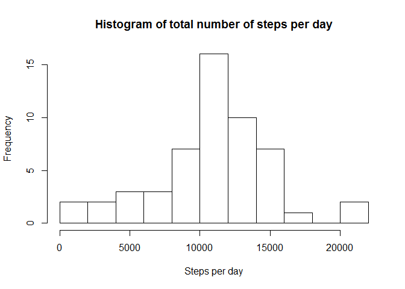
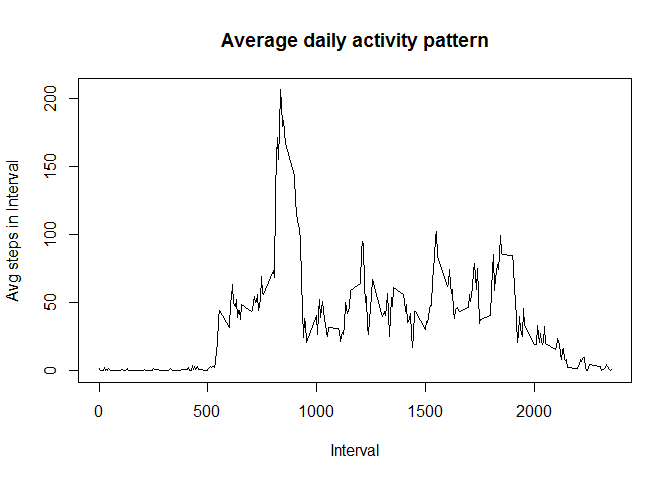
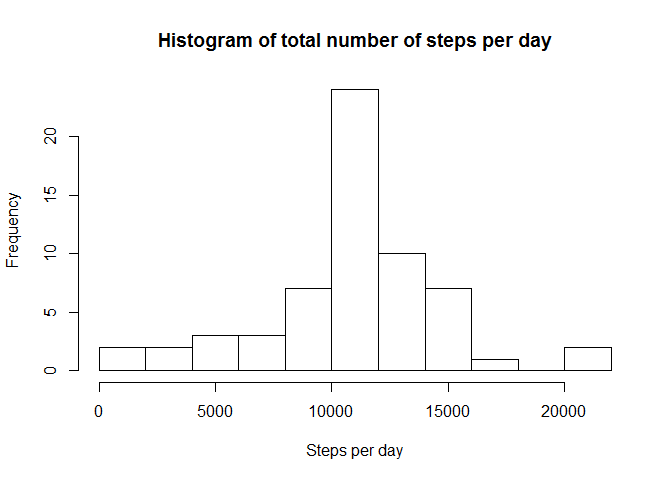
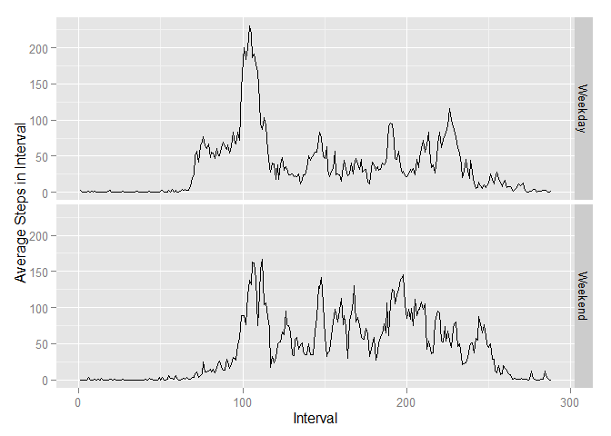

# Reproducible Research: Peer Assessment 1


## Loading and preprocessing the data

```r
unzip(zipfile="activity.zip")
data <- read.csv("activity.csv")
```

## What is mean total number of steps taken per day?

For this part of the assignment, you can ignore the missing values of the dataset.

* Make a histogram of the total number of steps taken eack day


```r
totalSteps <- tapply(data$steps, data$date, sum)
hist(totalSteps, breaks= 10, main = "Histogram of total number of steps per day" , xlab = "Steps per day", ylab = "Frequency")
```

 

* Calculate and report the mean and median total number of steps taken per day.

Mean :

```r
mean(totalSteps, na.rm=TRUE)
```

```
## [1] 10766.19
```

Median:

```r
median(totalSteps, na.rm=TRUE)
```

```
## [1] 10765
```


## What is the average daily activity pattern?

* Make a time series plot (i.e. type = "l") of the 5-minute interval (x-axis) and the average number of steps taken, averaged across all days (y-axis)


```r
avgStepsPerInterval <- aggregate(steps ~ interval, data = data, mean, na.rm = TRUE)
plot(avgStepsPerInterval, type = "l", main = ("Average daily activity pattern"), ylab = "Avg steps in Interval", xlab = "Interval")
```

 

* Which 5-minute interval, on average across all the days in the dataset, contains the maximum number of steps?

```r
maxIntervalDays <- max(avgStepsPerInterval, na.rm=TRUE)
as.numeric(which(avgStepsPerInterval == maxIntervalDays))
```

```
## [1] 288
```

## Imputing missing values

Note that there are a number of days/intervals where there are missing values (coded as NA). The presence of missing days may introduce bias into some calculations or summaries of the data.

* Calculate and report the total number of missing values in the dataset (i.e. the total number of rows with NAs)

```r
sum(as.numeric(is.na(data$steps)))
```

```
## [1] 2304
```
* Devise a strategy for filling in all of the missing values in the dataset. The strategy does not need to be sophisticated. For example, you could use the mean/median for that day, or the mean for that 5-minute interval, etc.

```r
# Replace each missing value with the mean value of its 5-minute interval
newInterval <- function(interval) {
    avgStepsPerInterval[avgStepsPerInterval$interval == interval, ]$steps       
}
```
* Create a new dataset that is equal to the original dataset but with the missing data filled in

```r
filledData <- data
count = 0
for (row in 1:length(filledData$steps)){
        if(is.na(filledData[row, ]$steps)){
                filledData[row, ]$steps = newInterval(filledData[row, ]$interval)
                count = count +1
        }
}
cat("Total ", count, "NA values were filled.\n\r")
```

```
## Total  2304 NA values were filled.
## 
```
* Make a histogram of the total number of steps taken each day and Calculate and report the mean and median total number of steps taken per day. Do these values differ from the estimates from the first part of the assignment? What is the impact of imputing missing data on the estimates of the total daily number of steps? What is the impact of imputing missing data on the estimates of the total daily number of steps?

```r
totalFilledSteps <- aggregate(steps ~ date, data = filledData, sum)
hist(totalFilledSteps$steps, breaks = 10, main = "Histogram of total number of steps per day" , xlab = "Steps per day", ylab = "Frequency")
```

 


```r
mean(totalFilledSteps$steps)
```

```
## [1] 10766.19
```


```r
median(totalFilledSteps$steps)
```

```
## [1] 10766.19
```

The mean value is the same as the value before imputing missing data because we put the mean value for that particular 5-min interval. 


## Are there differences in activity patterns between weekdays and weekends?

For this part the weekdays() function may be of some help here. Use the dataset with the ???lled-in missing values for this part.

* Create a new factor variable in the dataset with two levels - "weekday" and "weekend" indicating whether a given date is a weekday or weekend day.

```r
Sys.setlocale("LC_TIME", "English")
```

```
## [1] "English_United States.1252"
```

```r
filledData$weekday = weekdays(as.Date(filledData$date))
filledData$type = ifelse(filledData$weekday=="Saturday"|filledData$weekday=="Sunday","Weekend","Weekday")
filledData$type  =as.factor(filledData$type)
filledData$interval=as.factor(filledData$interval)
```
* Make a panel plot containing a time series plot (i.e. type = "l") of the 5-minute interval (x-axis) and the average number of steps taken, averaged across all weekday days or weekend days (y-axis). The plot should look something like the following, which was creating using simulated data:


```r
library(ggplot2)
r=aggregate(filledData$steps,list(as.factor(filledData$interval),as.factor(filledData$type)),mean)
p <- ggplot(r, aes(x = as.integer(Group.1), y=x)) + geom_line()
p + facet_grid(Group.2~.)+xlab("Interval")+ylab("Average Steps in Interval")
```

 

